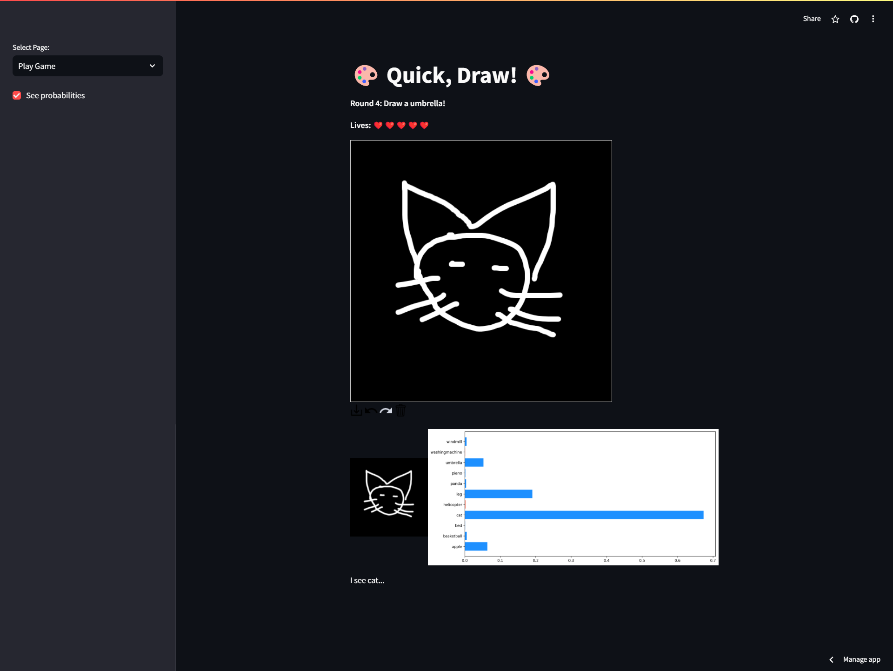
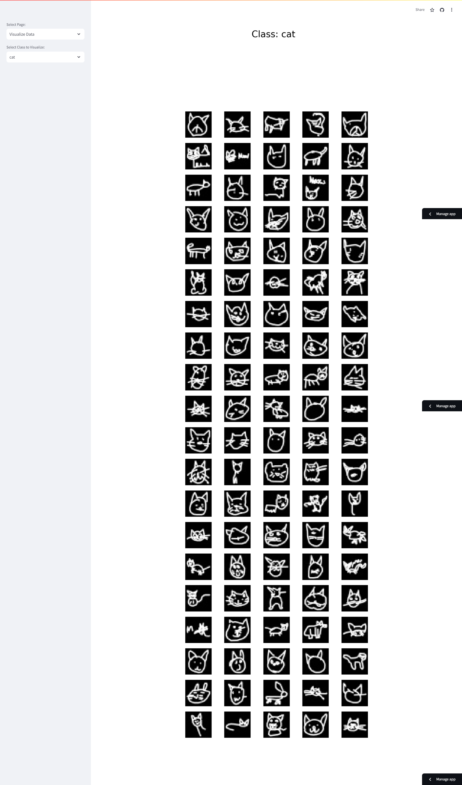

# Quick, Draw 🖌️ &nbsp; 🖼️

Can a neural network learn to recognize doodling? [Quick, Draw](https://quickdraw.withgoogle.com/)

## Description 👨‍🎨
Quick, Draw! is an online game developed by Google that challenges players to draw a picture of an object or idea and then uses a neural network artificial intelligence to guess what the drawings represent. The AI learns from each drawing, increasing its ability to guess correctly in the future.The game is similar to Pictionary in that the player only has a limited time to draw (20 seconds).The concepts that it guesses can be simple, like 'foot', or more complicated, like 'animal migration'. This game is one of many simple games created by Google that are AI based as part of a project known as 'A.I. Experiments'. [Quick, Draw](https://quickdraw.withgoogle.com/)

## Dataset 🗃️
Follow the documentation [here](https://github.com/googlecreativelab/quickdraw-dataset) to get the dataset. I got `.npy` files from google cloud for 14 drawings.

#### Labels
1) Apple 
2) Basketball 
3) Bed 
4) Cat 
5) Helicopter 
6) Leg 
7) Panda 
8) Piano 
9) Umbrella
10) Washing machine 
11) Windmill 

## Deployed app 🔱
[Deployed app](https://quickdraw.streamlit.app/)

###### Made with ❤️ by tuankietcao
